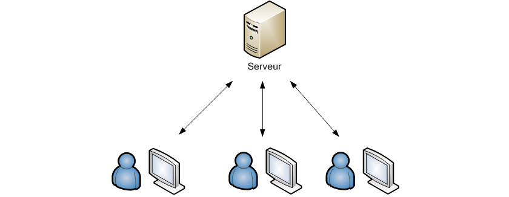
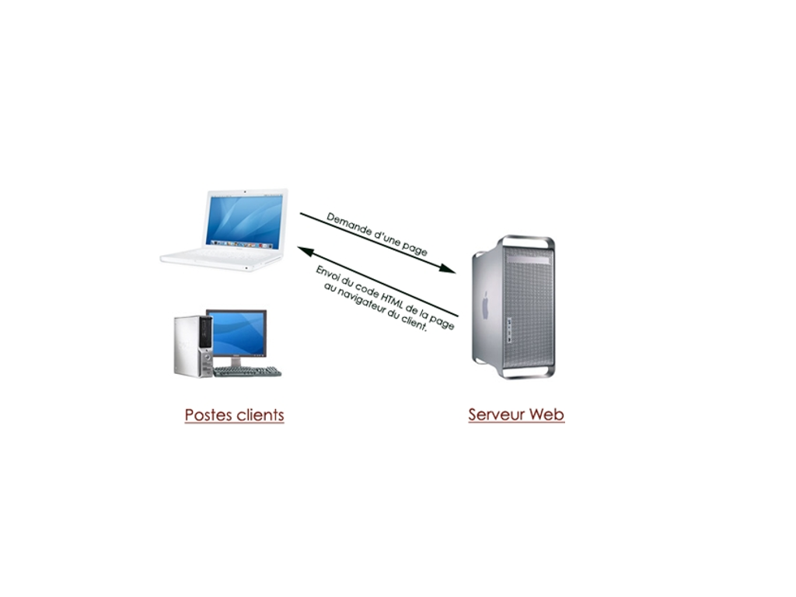

# 1 - Architecture client/serveur

--------------------------------------------------------------------------------

# La notion de réseau

## Qu'est-ce qu'un réseau ?

C’est un ensemble de matériels et de logiciels permettant à des
équipements de communiquer entre eux.
Objectif : Partager des ressources matérielles (disques durs,
imprimantes) et des ressources logicielles (fichiers, applications).

## Comment communique-t-on en réseau ?

Pour que deux machines communiquent, elles ont besoin :

* de l'**adresse IP** de l'autre machine
* d'un **port** libre et ouvert
* d'un **protocole de communication** commun

--------------------------------------------------------------------------------

# La notion de réseau

## Adresse IP

*Une adresse IP est un numéro d'identification qui est attribué de façon permanente ou provisoire à chaque appareil connecté à un réseau informatique utilisant l'Internet Protocol.* - Wikipedia

## Port

*Un port est l'adresse d'une application sur une machine.* - OpenClassRooms

## Protocole de communication

*Un protocole est un ensemble de règles qui définissent comment se produit une communication dans un réseau.* - OpenClassRooms

--------------------------------------------------------------------------------

# Architecture client-serveur

L'architecture client/serveur désigne un mode de communication
entre plusieurs ordinateurs d'un réseau qui distingue un ou plusieurs
clients du serveur.

--------------------------------------------------------------------------------

# Architecture client-serveur

## Fonctionnement du serveur

* il est initialement *passif* ;
* il est à l'écoute, prêt à traîter les requêtes envoyées par des clients ;
* dès qu'une requête lui parvient, il la traite et envoie une réponse.

## Fonctionnement d'un client

* il est actif le premier ;
* il envoie des requêtes au serveur ;
* il attend et reçoit les réponses du serveur.

Le client doit connaitre l'**adresse IP** du serveur, le **port** et le
**protocole de communication** à utiliser.

--------------------------------------------------------------------------------

# Quelques protocoles connus

* FTP (File Transfer Protocol) / port 21: Échange de fichiers informatiques sur le réseau ;
* SMTP (Simple Mail Transfer Protocol) / port 25 : Échange d'emails sur le réseau ;
* SSH (Secure Shell) / port 22 : Connexion sécurisée à une machine distante.

et bien sûr ... celui dont nous allons parler :

* HTTP (HyperText Transfer Protocol) / port 80 : Protocole destiné à faire fonctionner le World Wide Web ;
* HTTPS (HyperText Transfer Protocol Secure) / port 443 : variante du HTTP sécurisée (les données qui transitent sont cryptées) ;

--------------------------------------------------------------------------------

# Le protocole HTTP (historique)

* Iventé par Tim Berners-Lee (CERN) pour créér le Word Wide Web !
* Objectif : Permettre le transfert de fichiers (HTML seulement au début) entre un serveur et un client.
* Très peu d'évolution depuis :
    * v0.9 : 1989
    * v1.0 : 1996
    * v1.1 : 1999
    * v2.0 : en cours de développement

--------------------------------------------------------------------------------

# Le protocole HTTP (fonctionnement)

* Une ressource (ex: une page web) est localisée par un identifiant appelé l'**URL**
* Le client envoie une **requête HTTP** à destination du serveur
* Le serveur traite la requête et renvoie une **réponse HTTP**

--------------------------------------------------------------------------------

# Fonctionnement d'un server web

.fx: imageslide

--------------------------------------------------------------------------------

# Le protocole HTTP (requête HTTP)

Une requête HTTP est composée d'une **ligne de requête**, de **champs d'entête** et éventuellement d'un **corps**.

Structure :

    !html
        <COMMAND> <URL> <VERSION>
        <ENTÊTE> : <VALEUR>
        ...
        <ENTÊTE> : <VALEUR>
        (ligne vide)
        <CORPS>

Exemple :

    !html
        GET http://www.google.fr HTTP/1.0
        Accept : text/html
        Accept-Language : FR

--------------------------------------------------------------------------------

# Le protocole HTTP (requête HTTP)

Une liste restreinte de commandes (ou méthodes) sont normalisées dans le protocole HTTP. Quelques exemples :

* ``GET`` : Récupération de la ressource
* ``POST`` : Envoi d'informations à un programme informatique
* ``DELETE`` : Suppression de la ressource

Liste détaillée : http://fr.wikipedia.org/wiki/Hypertext_Transfer_Protocol

De la même manière, les champs d'entête sont standardisés. Quelques exemples :

* ``Date`` : Date de la requête
* ``Accept`` : Type de contenu accepté en réponse
* ``Accept-Language`` : Langue attendue en réponse

Liste détaillée : http://commentcamarche.net/contents/520-le-protocole-http#en-tetes

--------------------------------------------------------------------------------

# Le protocole HTTP (réponse HTTP)

Une réponse HTTP est composée d'une **ligne de statut**, de **champs d'entête** et du **corps de la réponse**.

Structure :

    !html
        <VERSION-HTTP> <CODE> <EXPLICATION>
        <ENTÊTE> : <VALEUR>
        ...
        <ENTÊTE> : <VALEUR>
        (ligne vide)
        <CORPS>

Exemple :

    !html
        HTTP/1.0 200 OK    
        Date : Sun, 15 Dec 2013 13:06:18 GMT
        Content-Type : text/HTML    
        Content-Length : 1245    

        <html><title>Google</title><body>Welcome! ...

--------------------------------------------------------------------------------

# Le protocole HTTP (réponse HTTP)

Les statuts de réponse sont normalisés et classifiés grâce à leur code :

* ``1xx`` : Information
* ``2xx`` : Succès
* ``3xx`` : Redirection
* ``4xx`` : Erreur Client (ex: 404 - Page introuvable, 403 - Non autorisé)
* ``5xx`` : Erreur Serveur

Liste détaillée  : `<http://www.codeshttp.com/>`_

Les champs d'entête sont eux aussi standardisés. Quelques exemples :

* ``Date`` : Date de la réponse
* ``Content-Language`` : Langue du corps de la réponse

Liste détaillée : http://commentcamarche.net/contents/520-le-protocole-http#en-tetes-de-reponse

--------------------------------------------------------------------------------

# Résumé & Démo