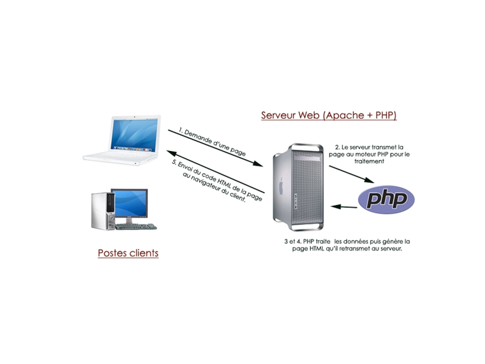

Initiation au développement web : Architecture client/serveur
==============================================================

--------------------------------------------------------------------------------

Qu'est-ce-qu'un réseau ?
========================

C’est un ensemble de matériels et de logiciels permettant à des
équipements de communiquer entre eux.
Objectif : Partager des ressources matérielles (disques durs,
imprimantes) et des ressources logicielles (fichiers, applications).

Comment communique-t-on en réseau ?
------------------------------------
Pour que deux machines communiquent, elles ont besoin :

* de l'**adresse IP** de l'autre machine
* d'un **port** libre et ouvert
* d'un **protocole de communication** commun

--------------------------------------------------------------------------------

Adresse IP
===========

`Une adresse IP est un numéro d'identification qui est attribué de façon permanente ou provisoire à chaque appareil connecté à un réseau informatique utilisant l'Internet Protocol.` - Wikipedia

Port
=====

`Un port est l'adresse d'une application sur une machine.` - OpenClassRooms

Protocole de communication
===========================

`Un protocole est un ensemble de règles qui définissent comment se produit une communication dans un réseau.` - OpenClassRooms

--------------------------------------------------------------------------------

Quelques protocoles connus
===========================

* HTTP (HyperText Transfer Protocol) / port 80 : Protocole destiné à faire fonctionner le World Wide Web ;
* HTTPS (HyperText Transfer Protocol Secure) / port 443 : variante du HTTP sécurisée (les données qui transitent sont cryptées) ;
* FTP (File Transfer Protocol) / port 21: Échange de fichiers informatiques sur le réseau ;
* SMTP (Simple Mail Transfer Protocol) / port 25 : Échange d'emails sur le réseau ;
* SSH (Secure Shell) / port 22 : Connexion sécurisée à une machine distante.

--------------------------------------------------------------------------------

Architecture client-serveur
============================

L'architecture client/serveur désigne un mode de communication
entre plusieurs ordinateurs d'un réseau qui distingue un ou plusieurs
clients du serveur.

.. image:: client-server.png

--------------------------------------------------------------------------------

Architecture client-serveur
============================

Fonctionnement du serveur
--------------------------

* il est initialement *passif* ;
* il est à l'écoute, prêt à traîter les requêtes envoyées par des clients ;
* dès qu'une requête lui parvient, il la traite et envoie une réponse.

Fonctionnement d'un client
---------------------------
* il est actif le premier ;
* il envoie des requêtes au serveur ;
* il attend et reçoit les réponses du serveur.

Le client doit connaitre l'**adresse IP** du serveur, le **port** et le
**protocole de communication** à utiliser.

--------------------------------------------------------------------------------

Fonctionnement d'un server web
================================

.fx: imageslide
