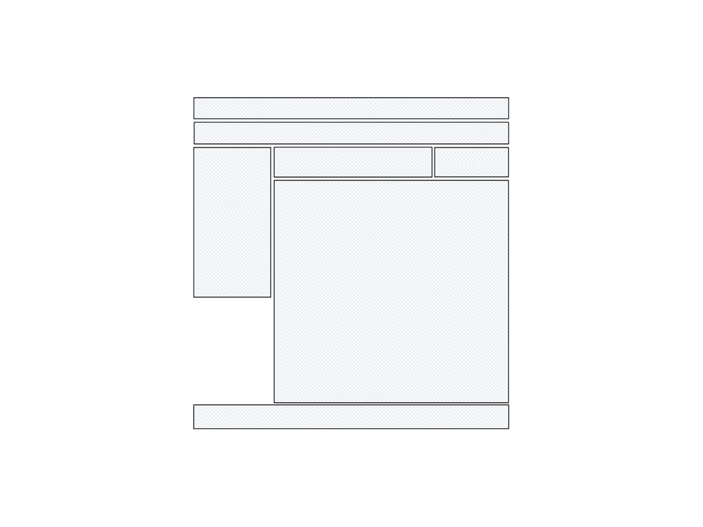
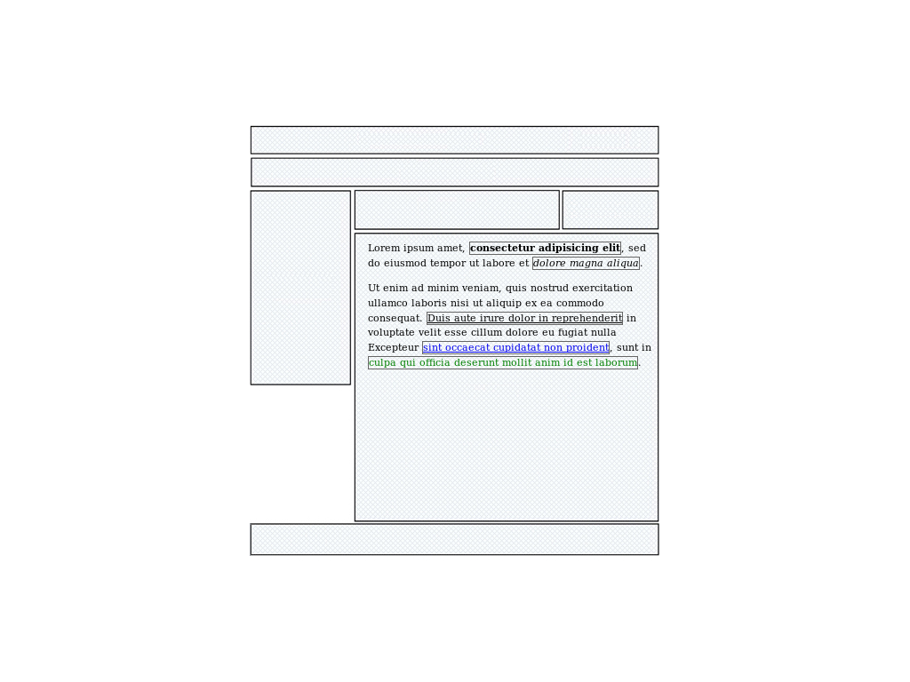

# 2 - Introduction aux langages HTML & CSS

--------------------------------------------------------------------------------

# Introduction au langage HTML

--------------------------------------------------------------------------------
# Introduction

Le langage HTML (*Hypertext Markup Language*) est un langage **de balisage** qui
permet de représenter le contenu de pages web. Il permet, principalement de :

- définir la structure sémantique du contenu
- le mettre en forme
- créer des liens (*hyperliens*) entre les pages

Il permet aussi :

- l'intégration de ressources multimedia
- la génération de formulaires web
- ...

Il est interprété **côté client** par le **navigateur web**.

--------------------------------------------------------------------------------

# Historique

Le langage HTML a été créé coinjointement au protocole HTTP pour créer le World 
Wide Web en 1989.

* 1995/1996 : Version 2.0
* 1997 : Version 3.2 et 4.0
* 2000 : XHTML (*Extensible Hypertext Markup Language*)
* 2007 : HTML 5 !

## Standardisation

Le langage HTML est un **standard**: Le W3C (World Wide Web Consortium) établit 
une liste de spécifications mais en aucun cas l'implémentation du langage.

Il est à la charge des constructeurs de navigateurs web de suivre ses
recommandations.

--------------------------------------------------------------------------------

# Structure d'une page HTML

    !html
    <!DOCTYPE html>
    <HTML>
      <HEAD>
        <TITLE>Titre de la page</TITLE>
      </HEAD>

      <BODY>
        Contenu de la page
      </BODY>
    </HTML>

--------------------------------------------------------------------------------

# Les balises HTML

Une balise HTML est un identifiant textuel délimité par les deux caractères
"<" et ">".

Il existe deux types de balises :

* Les balises "en paires"
* Les balises "orphelines"

--------------------------------------------------------------------------------

# Les balises "en paires"

Elle fonctionnent par deux : une **balise ouvrante** et une **balise fermante**.
La balise fermante se distingue par l'ajout du caractère "/".

Une balise de ce type agit sur le texte qu'elle encadre.

Exemples:

* ``<h1>`` CE TEXTE EST UN TITRE ``</h1>``
* ``<strong>`` **Ce texte est important** ``</strong>``
* ``<p>`` Ce texte est un paragraphe ``</p>``

## Imbrication de balises

Les balises HTML s'imbriquent. Exemple :

* ``<p>`` Du texte ``<strong>`` **important** ``</strong>`` dans un paragraphe. ``</p>``

--------------------------------------------------------------------------------

# Les balises "orphelines"

Les balises dites "orphelines" fonctionnent seules, elles sont utilisées pour
insérer un élément à un endroit précis.

Pour les différencier d'une balise ouvrante, on ajouter le caractère "/" juste avant le ">".

Exemples :

* ``<br />`` : saut de ligne
* ``<hr />`` : séparation horizontale
* ```` : insertion d'une image
* ``<input />`` : champ de formulaire

--------------------------------------------------------------------------------

# Les attributs de balises

Les **attributs** permettent de donner des informations supplémentaires sur une balise.
Ils se placent à dans la déclaration de la balise, comme ceci :
    
    !html
    <balise attribut1="valeur1" attribut2="valeur2">

Certains attributs peuvent être placés sur n'importe quelle balise comme ``id``
qui spécifie l'identifiant unique d'une balise :

    !html
    <p id="introduction">Bienvenue au cours sur HTML</p>

D'autres sont spécifiques à un type de balise comme ``src`` qui spécifie
l'adresse de l'image à insérer pour une balise ```` :

    !html
    

Bien sûr, il peut y avoir plusieurs attributs de spécifiés pour une balise. Ex:

    !html
    

--------------------------------------------------------------------------------

# Les liens

La balise ``<a>`` permet de créer des liens (hyperliens) entre les pages.

## Syntaxe

    !html
    <a href="URL" title="titre">Texte</a>

## Exemple

    !html
    <a href="http://duckduckgo.com"
       title="Lien vers duckduckgo">Go on Duck !</a>

## L'attribut target

L'attribut ``target``, à utiliser avec parcimonie, permet de choisir où la page visée par le lien va s'ouvrir. Ex pour ouvrir un lien dans une nouvelle fenêtre :

    !html
    <a href="http://duckduckgo.com"
       title="Lien vers duckduckgo"
       target="_blank">Go on Duck !</a>

--------------------------------------------------------------------------------

# TP : Une première page HTML

Créer une page HTML correctement structurée.

Utiliser *au moins* ces quelques balises principales :


    !html
    <h1>, <h2>, ..., <h6> : titres de niveaux 1 à 6
    <p> : paragraphe
    <strong> : texte important (renforcement)
    <em> : texte mis en valeur (emphase)
    <a href="..."> : hyperlien
     : insertion d'une image
    <br /> : saut de ligne
    <ul> : liste
    <li> : item de liste

## Liens

* Un aide-mémoire des balises existantes : http://fr.openclassrooms.com/informatique/cours/apprenez-a-creer-votre-site-web-avec-html5-et-css3/memento-1

--------------------------------------------------------------------------------

# Les balises META

## Qu'est-ce qu'une balise META ?

Les balises META servent à donner des informations supplémentaires à propos de la page HTML, ce qu'on appelle des **métadonnées** (*des données sur les données*).

Leur utilité est discutable (et discutée) et finalement, dépend beaucoup de balise en question : certaines sont obsolètes et d'autres ont encore une certains utilité.

## Syntaxe

    !html
    <meta name="nom de la balise" content="valeur" />

Note 1 : La balise ``title`` que nous avons déjà vue est parfois considérée comme une balise meta malgré sa syntaxe différente.

Note 2 : Cette syntaxe est généraliste mais d'autres balises META dérogent à la règle ;-).

--------------------------------------------------------------------------------

# Quelques exemples de balises META

Les balises ``description`` et ``keywords`` (assez obsolète) permettent de fournir une description et des mots clés à propos du contenu de la page :

    !html
    <meta name="description"
          content="Cours d'introduction à HTML" />
    <meta name="keywords"
          content="HTML, CSS, page web" />


La balise ``author`` permet de spécifier l'auteur de la page :

    !html
    <meta name="author" content="Florent Lebreton" />

La balise ``generator`` permet de spécifier avec quel outil a été générer la page :

    !html
    <meta name="generator" content="landslide" />

--------------------------------------------------------------------------------

# Quelques exemples de balises META

Les balises de type ``http-equiv`` sont des équivalents des champs d'entête HTTP. Elles permettent de les suppléer en cas de mavaise configuration du serveur. La plus utile, ``Content-type`` permet de préciser l'encodage utilisé pour la page HTML :

    !html
    <meta http-equiv="Content-Type"
          content="text/html; charset=utf-8" />

Grâce aux balises, il est possible de donner des indications au moteur de recherche. Par exemple, de ne pas indexer la page :

    !html
    <meta name="robots" content="noindex" />

--------------------------------------------------------------------------------

# TP : Utiliser mes balises META

Préciser quelques informations à propos de la page HTML précédente en utilisant les balises META.

## Liens

* Un très bon article sur les balises META : http://alsacreations.com/article/lire/628-balises-meta.html

--------------------------------------------------------------------------------

# Introduction au langage CSS

--------------------------------------------------------------------------------

# Introduction

Le langage CSS (*Cascading Style Sheet*, en français *Feuilles de style en cascade*)
permet de mettre en forme les documents HTML.

## Standardisation

De la même manière que le langage HTML, le CSS est un **standard** dont les
spécifications sont établies par le W3C. Il est aussi à la charge des
constructeurs de navigateurs web de suivre ses recommandations.

## Historique

* CSS 1 : 1996/1997 - version très simplifiée (~50 propriétés)
* CSS 2 : 1998 - version peu réussie malgré 70 nouvelles propriétés
* CSS 2.1 : 2001 - révision en profondeur de CSS2, très utilisée
* CSS 3 : 2007~2010 - nouvelle version de plus en plus utilisée

--------------------------------------------------------------------------------

# HTML & CSS

Deux langages pour séparer le  **fond** et la **forme** !

## HTML : ** Le fond **

* Structurer le contenu (titres, sous-tires, paragraphes, ...)
* Lui donner du sens (mise en valeur du texte, ...)

## CSS : ** La forme **

* Mettre en forme la page (disposition, marges, couleurs de fond, ...)
* Mettre en forme le texte (couleur, graisse, taille, alignement...)

--------------------------------------------------------------------------------

# HTML & CSS

Exemple: Je veux mettre une portion de texte en valeur.

## Ce qu'il ne faut pas faire

* Utiliser la balise ``<b>`` dont le sens est : mettre le texte en gras

## Ce qu'il faut faire

* Utiliser la balise ``<strong>`` dont le sens est : le texte est important
* Mettre en forme ce texte avec du CSS : laisser en gras (par défaut) ou autre

--------------------------------------------------------------------------------

# Syntaxe

Une feuille de style est structurée en **règles CSS**.

    !css
    selecteur {
        propriete: valeur;
        ...
        propriete: valeur;
    }

 Le **sélecteur** permet d'indiquer à quels éléments HTML s'applique la règle.
 Le **bloc de déclaration** englobe les déclarations que l'on souhaite voir
 appliquées aux éléments visés par le sélecteur. 

## Exemple de règle CSS

    !css
    h1 {
        text-decoration: underline;
        font-weight: bold;
        margin-top: 10px;
    }

--------------------------------------------------------------------------------

# Quelques exemples de propriétés

--------------------------------------------------------------------------------

# Mise en page

Elles sont utilisées pour faire la mise en page : allure générale de la page, création de colonnes, placement de blocs d'information, ...

    !css
    width: 200px;           /* largeur */
    height: 300px;          /* hauteur */
    margin: 5px;            /* marges extérieures */
    padding: 10px;          /* marges intérieures */
    display: block;         /* mode d'affichage */
    position: static;       /* mode de positionnement */

--------------------------------------------------------------------------------

# Mise en forme de la page

Leur utilisation a pour objectif de réaliser la mise en forme (la décoration) générale de la page ou d'éléments de la page.

    !css
    border: 1px solid red;      /* bordure */
    background: blue;           /* fond */
    text-align: center;         /* alignement horizontal */
    vertical-align: middle:     /* alignement vertical */
    line-height: 150%;          /* interligne */

--------------------------------------------------------------------------------

# Mise en forme du texte

Diverses propriétés permettent de mettre en forme le texte : changement de police, taille, graisse, ...

    !css
    font-family: Sans-Serif     /* police */
    font-size: 12pt             /* taille du texte */
    color: #646464;             /* couleur du texte */
    font-weight: bold;          /* graisse du texte */
    text-decoration: underline; /* texte souligné, barré, ... */


## Liens

* Un aide-mémoire des propriétés existantes : http://fr.openclassrooms.com/informatique/cours/apprenez-a-creer-votre-site-web-avec-html5-et-css3/memento-1-1

--------------------------------------------------------------------------------

# Les sélecteurs

--------------------------------------------------------------------------------

# Les sélecteurs

    !html
    <p> Présentation de ma famille: 
      <span id="papa" class="adulte homme">Pierre</span>
      <span id="maman" class="adulte femme">Catherine</span>
      <span id="fils" class="enfant homme">Jean</span>
      <span id="fille" class="enfant femme">Lola</span>
    </p>

## Sélecteur de balise

    !css
    span {
      font-style: italic;
    }

La règle s'applique à toutes les balises correspondant au sélecteur :

<style type="text/css">
    #s1, #s2, #s3 { background: #efefef; color: black; padding: 3px;}
    #s1 span { font-style: italic; }
</style>
<p id="s1"> Présentation de ma famille:
  <span id="papa" class="adulte homme">Pierre</span>
  <span id="maman" class="adulte femme">Catherine</span>
  <span id="fils" class="enfant homme">Jean</span>
  <span id="fille" class="enfant femme">Lola</span>
</p>

--------------------------------------------------------------------------------

# Les sélecteurs

    !html
    <p> Présentation de ma famille: 
      <span id="papa" class="adulte homme">Pierre</span>
      <span id="maman" class="adulte femme">Catherine</span>
      <span id="fils" class="enfant homme">Jean</span>
      <span id="fille" class="enfant femme">Lola</span>
    </p>

## Sélecteur de classe

    !css
    span { font-style: italic; }
    .adulte { font-size: 150%; }
    .homme { color: blue; }


La règle s'applique à toutes les balises possédant la classe du sélecteur :

<style type="text/css">
    #s2 span { font-style: italic; }
    #s2 .adulte { font-size: 150%; }
    #s2 .homme { color: blue; }
</style>
<p id="s2"> Présentation de ma famille:
  <span id="papa" class="adulte homme">Pierre</span>
  <span id="maman" class="adulte femme">Catherine</span>
  <span id="fils" class="enfant homme">Jean</span>
  <span id="fille" class="enfant femme">Lola</span>
</p>

--------------------------------------------------------------------------------

# Les sélecteurs

    !html
    <p> Présentation de ma famille: 
      <span id="papa" class="adulte homme">Pierre</span>
      <span id="maman" class="adulte femme">Catherine</span>
      <span id="fils" class="enfant homme">Jean</span>
      <span id="fille" class="enfant femme">Lola</span>
    </p>

## Sélecteur d'id

    !css
    span { font-style: italic; }
    .adulte { font-size: 150%; }
    .homme { color: blue; }
    #papa { font-weight: bold; }


La règle s'applique à **la** balise possédant l'identifiant du sélecteur :

<style type="text/css">
    #s3 span { font-style: italic; }
    #s3 .adulte { font-size: 150% !important; }
    #s3 .homme { color: blue !important; }
    #s3 #papa { font-weight: bold; }
</style>
<p id="s3"> Présentation de ma famille:
  <span id="papa" class="adulte homme">Pierre</span>
  <span id="maman" class="adulte femme">Catherine</span>
  <span id="fils" class="enfant homme">Jean</span>
  <span id="fille" class="enfant femme">Lola</span>
</p>

--------------------------------------------------------------------------------

# Inclusion des règles CSS

--------------------------------------------------------------------------------

## Inclusion d'une feuille de styles externe

### Page HTML : index.html

    !html
    <html>
      <head>
        <title>Ma page web</title>
        <link rel="stylesheet" href="stylesheet.css" />
      </head>
      <body>
        <p>Bonjour</p>
      </body>
    </html>

### Feuille de styles CSS : stylesheet.css

    !css
    p {
        color: blue;
    }

--------------------------------------------------------------------------------

## Inclusion dans une page HTML

    !html
    <html>
      <head>
        <title>Ma page web</title>
        <style type="text/css">
            p {
                color: blue;
            }
        </style>
      </head>
      <body>
        <p>Bonjour</p>
      </body>
    </html>


La solution précédente est préférable car elle permet de séparer le CSS du HTML et d'utiliser la feuille de styles sur plusieurs pages HTML.

--------------------------------------------------------------------------------

## Inclusion dans une page HTML

    !html
    <html>
      <head>
        <title>Ma page web</title>
      </head>
      <body>
        <p style="color: blue;">Bonjour</p>
      </body>
    </html>

Cette solution est a éviter autant que possible car elle fige la mise en forme dans le code HTML. Il sera donc impossible de modifier cette mis en forme en ne touchant qu'à la feuille de styles.

--------------------------------------------------------------------------------

# Le reset CSS

--------------------------------------------------------------------------------

# Qu'est-ce que le reset CSS ?

Le comportement par défaut de certaines balises diffère selon les navigateur.

On peut utiliser ce qu'on appelle un *reset css* pour uniformiser le comportement par défaut des balises. Souvent, on se limite au ``margin`` et ``padding`` mais on peut aussi normaliser d'autres propriétés comme le ``font-size``, le ``line-height`` ou le ``font-weight``.

## L'ancienne méthode, obsolète

    !css
    * {
        margin: 0;
        padding: 0;
    }

Cette technique pose un problème de performance car cette règle agit sur *toutes* les balises de la page.

--------------------------------------------------------------------------------

# Méthodes correctes

D'autres méthodes sont donc à privilégier.

## Utiliser un reset plus précis

* http://meyerweb.com/eric/thoughts/2007/05/01/reset-reloaded/
* https://github.com/necolas/normalize.css/blob/master/normalize.css

## Écrire un reset personnalisé

L'idéal est d'agir seulement sur les balises qu'on utilise, par exemple :

    !css
    html, body, h1, h2, h3, ul {
        margin: 0;
        padding: 0;
    }

--------------------------------------------------------------------------------

# TP : Une première feuille de styles

* Reprendre la page HTML précédente
* Mettre en forme cette page avec du CSS
* Utiliser les différents sélecteurs vus
* Jouer avec les propriétés basiques présentées

--------------------------------------------------------------------------------

# Blocs et conteneurs

--------------------------------------------------------------------------------

# Blocs et conteneurs

Les balises HTML peuvent (pour la plupart) se classer dans deux grandes catégories :

* Les balises de type ``block`` (bloc) ;
* Les balises de type ``inline`` (en ligne).

--------------------------------------------------------------------------------

# Les balises de type ``block``

## Caractéristiques

* elles se positionnent les unes en dessous des autres ;
* elles sont dimenssionnables (largeur, hauteur, marges, ...) ;
* elles peuvent contenir tout type de balise.

## Utilisation

Elles sont utilisées principalement pour **mettre en forme la page** :
gabarit de la page, disposition des blocs d'information, ...

## Quelques balises de type ``block``

    !html
    <div>, <h1>...<h6>, <p>, <ul>, ...

--------------------------------------------------------------------------------

# Mise en forme de la page (balises block)



.fx: imageslide

--------------------------------------------------------------------------------

# Les balises de type ``inline``

## Caractéristiques

* elles se positionnent les unes à côté des autres ;
* la largeur d'un élément est limitée à celle de son contenu ;
* elles peuvent contenir du texte ou d'autres balises de type inline seulement.

## Utilisation

Elles sont utilisées principalement pour **mettre en forme le texte** :
création de liens, mise en exergue d'une partie de texte, ...

## Quelques balises de type ``inline``

    !html
    <span>, <a>, , <strong>, <em>, <u>, <b>, <i>, ...

--------------------------------------------------------------------------------

# Mise en forme du texte (balises inline)



.fx: imageslide

--------------------------------------------------------------------------------

# La propriété CSS ``display``

Ce mode d'affichage peut être modifié par la propriété CSS *display*.

Chaque balise a donc un *display* par défaut, et la plupart peuvent se classer
dans une des deux catégories ``block`` ou ``inline``.

Exemple :

    !css
    #element-en-bloc {
        display: block;
    }

    .elements-en-ligne {
        display: inline;
    }

``block`` et ``inline`` sont les deux principaux ``display`` mais il existe d'autres types de *display* :
``inline-block``, ``table``, ``table-cell``, ...
