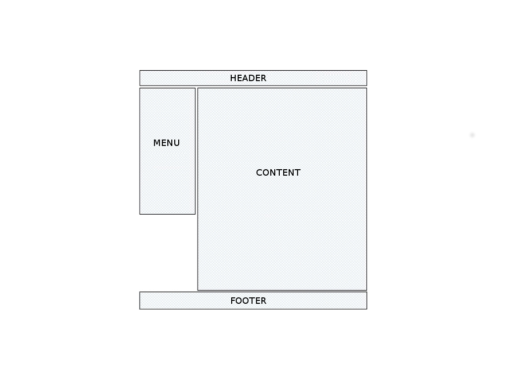

# Introduction au langage HTML

--------------------------------------------------------------------------------

# Introduction

Le langage HTML (*Hypertext Markup Language*) est un langage **de balisage** qui
permet de représenter le contenu de pages web. Il permet, principalement :

- de définir la structure sémantique du contenu
- de le mettre en forme
- de créer des liens (*hyperliens*) entre les pages

Il permet aussi :

- l'intégration de ressources multimedia
- la génération de formulaires web
- ...

Il est interprété **côté client** par le **navigateur web**.

--------------------------------------------------------------------------------

# Historique

Le langage HTML a été créé coinjointement au protocole HTTP pour créer le World 
Wide Web en 1989.

* 1995/1996 : Version 2.0
* 1997 : Version 3.2 et 4.0
* 2000 : XHTML (*Extensible Hypertext Markup Language*)
* 2007 : HTML 5 !

## Standardisation

Le langage HTML est un **standard**: Le W3C (World Wide Web Consortium) établit 
une liste de spécifications mais en aucun cas l'implémentation du langage.

Il est à la charge des constructeurs de navigateurs web de suivre ses
recommandations.

--------------------------------------------------------------------------------

# Structure d'une page HTML

    !html
    <!DOCTYPE html PUBLIC "-//W3C//DTD XHTML 1.0 Strict//EN"
      "http://www.w3.org/TR/xhtml1/DTD/xhtml1-strict.dtd">
    <HTML>
      <HEAD>
        <TITLE>Titre de la page</TITLE>
      </HEAD>

      <BODY>
        Contenu de la page
      </BODY>
    </HTML>

--------------------------------------------------------------------------------

# Les balises HTML

Une balise HTML est un identifiant textuel délimité par les deux caractères
"<" et ">".

Il existe deux types de balises :

* Les balises "en paires"
* Les balises "orphelines"

--------------------------------------------------------------------------------

# Les balises "en paires"

Elle fonctionnent par deux : une **balise ouvrante* et une **balise fermante**.
La balise fermante se distingue par l'ajout du caractère "/".

Une balise de ce type agit sur le texte qu'elle encadre.

Exemples:

* ``<h1>`` CE TEXTE EST UN TITRE ``</h1>``
* ``<b>`` **Ce texte est en gras** ``</b>``
* ``<p>`` Ce texte est un paragraphe ``</p>``

## Imbrication de balises

Les balises HTML s'imbriquent. Exemple :

* ``<p>`` Du texte ``<b>`` **en gras** ``</b>`` dans un paragraphe. ``</p>``

--------------------------------------------------------------------------------

# Les balises "orphelines"

Les balises dites "orphlines" fonctionnent seules, elles sont utilisées pour
insérer un élément à endroit précis.

Pour les différencier d'une balise ouvrante, on ajouter le caractère "/" juste avant le ">".

Exemples :

* ``<br />`` : saut de ligne
* ``<hr />`` : séparation horizontale
* ```` : insertion d'une image
* ``<input />`` : champ de formulaire

--------------------------------------------------------------------------------

# Les attributs de balises

Les **attributs** permettent de donner des informations supplémentaires sur une balise.
Il se placent à dans la déclaration de la balise, comme ceci :
    
    !html
    <balise attribut1="valeur1" attribut2="valeur2" />

Certains attributs peuvent être placé sur n'importe quelle balise comme ``id``
qui spécifie l'identifiant unique d'une balise. Ex:

    !html
    <p id="introduction">Bienvenue au cours sur HTML</p>

D'autres sont spécifiques à un type de balise comme ``src`` qui spécifie
l'adresse de l'image à insérer pour une balises ````. Ex:

    !html
    

Bien sûr, peut y avoir plusieurs attributs de spécifier pour une balise. Ex:

    !html
    

--------------------------------------------------------------------------------

# TP 1 : Une première page HTML

* Créer une page HTML correctement structurée
* Utiliser ces quelques balises principales :

&nbsp;

    !html
    <h1>, <h2>, ..., <h6> : titres de niveaux 1 à 6
    <p> : paragraphe
    <strong> : texte important (renforcement)
    <em> : texte mis en valeur (emphase)
    <a href="..."> : hyperlien
     : insertion d'une image
    <br /> : saut de ligne
    <ul> : liste
    <li> : item de liste

--------------------------------------------------------------------------------

# Introduction au langage CSS

--------------------------------------------------------------------------------

# Introduction

Le langage CSS (*Cascading Style Sheet*, en français *Feuilles de style en cascade*)
permet de mettre en forme les documents HTML.

## Standardisation

De la même manière que le langage HTML, le CSS est un **standard** dont les
spécifications sont établies par le W3C. Il est aussi à la charge des
constructeurs de navigateurs web de suivre ses recommandations.

## Historique

* CSS 1 : 1996/1997 - version très simplifiée (~50 propriétés)
* CSS 2 : 1998 - version peu réussie malgré 70 nouvelles propriétés
* CSS 2.1 : 2001 - révision en profondeur de CSS2, très utilisée
* CSS 3 : 2007~2010 - nouvelle version de plus en plus utilisée

--------------------------------------------------------------------------------

# HTML & CSS

Deux langage pour séparer le  **fond** et la **forme** !

## HTML : ** Le fond **

* Structurer le contenu (titres, sous-tires, paragraphes, ...)
* Lui donner du sens (mise en valeur du texte, ...)

## CSS : ** La forme **

* Mettre en forme la page (disposition, marges, couleurs de fond, ...)
* Mettre en forme le texte (couleur, graisse, taille, alignement...)

--------------------------------------------------------------------------------

# Syntaxe

Une feuille de style est structurée en **règles CSS**.

    !css
    selecteur {
        propriete: valeur;
        ...
        propriete: valeur;
    }

 Le **sélecteur permet** d'indiquer à quel élément HTML s'applique la règle.
 Le **bloc de déclaration** englobe les déclarations que l'on souhaite voir
 appliquées au sélecteur indiqué. 

## Exemple de règle CSS

    !css
    h1 {
        text-decoration: underline;
        font-weight: bold;
        margin-top: 10px;
    }

--------------------------------------------------------------------------------

# Quelques exemples de propriétés

## Mise en page

    !css
    width: 200px;               /* largeur */
    height: 300px;              /* hauteur */
    margin: 5px;                /* marges extérieures */
    padding: 10px;              /* marges intérieures */
    display: block;             /* mode d'affichage */
    position: static;           /* mode de positionnement */

--------------------------------------------------------------------------------

# Quelques exemples de propriétés

## Mise en forme

    !css
    border: 1px solid red;      /* bordure */
    background: blue;           /* fond */
    text-align: center;         /* alignement horizontal */
    vertical-align: middle:     /* alignement vertical */
    line-height: 150%;          /* interligne */

--------------------------------------------------------------------------------

# Quelques exemples de propriétés

## Texte

    !css
    font-family: Sans-Serif     /* police */
    font-size: 12pt             /* taille du texte */
    color: #646464;             /* couleur du texte */
    font-weight: bold;          /* graisse du texte */
    text-decoration: underline; /* texte souligné, barré, ... */

--------------------------------------------------------------------------------

# Les sélecteurs

--------------------------------------------------------------------------------

# Les sélecteurs

    !html
    <p> Présentation de ma famille: 
      <span id="papa" class="adulte homme">Pierre</span>
      <span id="maman" class="adulte femme">Catherine</span>
      <span id="fils" class="enfant homme">Jean</span>
      <span id="fille" class="enfant femme">Lola</span>
    </p>

## Sélecteur de balise

    !css
    span {
      font-style: italic;
    }

La règle s'applique à toutes les balises correspondant au sélecteur :

<style type="text/css">
    #s1, #s2, #s3 { background: #efefef; color: black; padding: 3px;}
    #s1 span { font-style: italic; }
</style>
<p id="s1"> Présentation de ma famille:
  <span id="papa" class="adulte homme">Pierre</span>
  <span id="maman" class="adulte femme">Catherine</span>
  <span id="fils" class="enfant homme">Jean</span>
  <span id="fille" class="enfant femme">Lola</span>
</p>

--------------------------------------------------------------------------------

# Les sélecteurs

    !html
    <p> Présentation de ma famille: 
      <span id="papa" class="adulte homme">Pierre</span>
      <span id="maman" class="adulte femme">Catherine</span>
      <span id="fils" class="enfant homme">Jean</span>
      <span id="fille" class="enfant femme">Lola</span>
    </p>

## Sélecteur de classe

    !css
    span { font-style: italic; }
    .adulte { font-size: 150%; }
    .homme { color: blue; }


La règle s'applique à toutes les balises possédant la classe du sélecteur :

<style type="text/css">
    #s2 span { font-style: italic; }
    #s2 .adulte { font-size: 150%; }
    #s2 .homme { color: blue; }
</style>
<p id="s2"> Présentation de ma famille:
  <span id="papa" class="adulte homme">Pierre</span>
  <span id="maman" class="adulte femme">Catherine</span>
  <span id="fils" class="enfant homme">Jean</span>
  <span id="fille" class="enfant femme">Lola</span>
</p>

--------------------------------------------------------------------------------

# Les sélecteurs

    !html
    <p> Présentation de ma famille: 
      <span id="papa" class="adulte homme">Pierre</span>
      <span id="maman" class="adulte femme">Catherine</span>
      <span id="fils" class="enfant homme">Jean</span>
      <span id="fille" class="enfant femme">Lola</span>
    </p>

## Sélecteur d'id

    !css
    span { font-style: italic; }
    .adulte { font-size: 150%; }
    .homme { color: blue; }
    #papa { font-weight: bold; }


La règle s'applique à **la** balise possédant l'identifiant du sélecteur :

<style type="text/css">
    #s3 span { font-style: italic; }
    #s3 .adulte { font-size: 150% !important; }
    #s3 .homme { color: blue !important; }
    #s3 #papa { font-weight: bold; }
</style>
<p id="s3"> Présentation de ma famille:
  <span id="papa" class="adulte homme">Pierre</span>
  <span id="maman" class="adulte femme">Catherine</span>
  <span id="fils" class="enfant homme">Jean</span>
  <span id="fille" class="enfant femme">Lola</span>
</p>

--------------------------------------------------------------------------------

# Inclusion des règles CSS

--------------------------------------------------------------------------------

## Inclusion d'une feuille de styles externe

### Page HTML : index.html

    !html
    <html>
      <head>
        <title>Ma page web</title>
        <link rel="stylesheet" href="stylesheet.css" />
      </head>
      <body>
        <p>Bonjour</p>
      </body>
    </html>

### Feuille de styles CSS : stylesheet.css

    !css
    p {
        color: blue;
    }

--------------------------------------------------------------------------------

## Inclusion dans une page HTML

    !html
    <html>
      <head>
        <title>Ma page web</title>
        <style type="text/css">
            body {
                color: blue;
            }
        </style>
      </head>
      <body>
        <p>Bonjour</p>
      </body>
    </html>

--------------------------------------------------------------------------------

## Inclusion dans une page HTML

    !html
    <html>
      <head>
        <title>Ma page web</title>
      </head>
      <body>
        <p style="color: blue;">Bonjour</p>
      </body>
    </html>


--------------------------------------------------------------------------------

# TP 2 : Une première feuille de styles

* Reprendre la page HTML précédente
* Mettre en forme cette page avec du CSS
* Utiliser les différents **sélecteurs** vus
* Jouer avec les **propriétés** basiques présentées

--------------------------------------------------------------------------------

# Blocs et conteneurs

--------------------------------------------------------------------------------

# Blocs et conteneurs

Les balises HTML peuvent (pour la plupart) se classer dans deux grandes catégories :

* Les balises de type ``block`` (bloc) ;
* Les balises de type ``inline`` (en ligne).

--------------------------------------------------------------------------------

# Les balises de type ``block``

## Caractéristiques

* elles se positionnent les unes en dessous des autres ;
* elles sont dimenssionnables (largeur, hauteur, marges, ...) ;
* elles peuvent contenir tout type de balise.

## Utilisation

Elles sont utilisées principalement pour **mettre en forme la page** :
gabarit de la page, disposition des blocs d'information, ...

## Quelques balises de type ``block``

    !html
    <div>, <h1>...<h6>, <p>, <ul>, ...

--------------------------------------------------------------------------------

# Mise en forme de la page (balises block)


.fx: imageslide

--------------------------------------------------------------------------------

# Les balises de type ``inline``

## Caractéristiques

* elles se positionnent les unes à côté des autres ;
* la largeur d'un élément est limitée à celle de son contenu ;
* elles peuvent contenir du texte ou d'autres balises de type inline seulement.

## Utilisation

Elles sont utilisées principalement pour **mettre en forme le texte** :
création de liens, mise en exergue d'une partie de texte, ...

## Quelques balises de type ``inline``

    !html
    <span>, <a>, , <strong>, <em>, <u>, <b>, <i>, ...

--------------------------------------------------------------------------------

# Mise en forme du texte (balises inline)


.fx: imageslide

--------------------------------------------------------------------------------

# La propriété CSS ``display``

Ce mode d'affichage peut être modifié par la propriété CSS *display*.

Chaque balise a donc un *display* par défaut, et la plupart peuvent se classer
dans une des deux catégories ``block`` ou ``inline``.

Exemple :

    !css
    #element-en-bloc {
        display: block;
    }

    .elements-en-ligne {
        display: inline;
    }

``block`` et ``inline`` sont les deux principaux ``display`` mais il existe d'autres types de *display* :
``inline-block``, ``table``, ``table-cell``, ...

--------------------------------------------------------------------------------

# Créer une mise en page

--------------------------------------------------------------------------------

# Un exemple de mise en page simple



.fx: imageslide

--------------------------------------------------------------------------------

# Éléments block, float et clear

Rappel : Pour réaliser la mise en page, nous utilisons des balises de type ``display: block``.

## La propriété CSS ``float``

Permet de spécifier si les éléments HTML suivants sont adjacents (et non les uns en dessous les autres)

    !css
    div {
        float: left | right | none;
    }

## Attention

Quand un élément a une propriété ``float``, on dit qu'il *sort du flux*: sa présence
n'est pas prise en compte par les autres éléments.

Pour éviter que l'élément suivant se superspose, il faut lui appliquer une marge.

--------------------------------------------------------------------------------

# Éléments block, float et clear

    !html
    <div id="image"></div>
    <div id="texte">Bonjour le chat !</div>

<style type="text/css">
.exfloat div {margin: 3px; padding: 3px; border: 1px solid blue;}
.exfloat .image {margin: 3px; padding: 3px; border: 1px solid red;}
.exfloat .image img {display: inline;};
</style>
<div class="exfloat">
  <div class="image"></div>
  <div>Bonjour le chat !</div>
</div>

## À noter

* Les deux blocs sont l'un en dessous de l'autre.
* Les deux blocs prennent 100% de la largeur disponible

--------------------------------------------------------------------------------

# Éléments block, float et clear

    !html
    <div id="image"></div>
    <div id="texte">Bonjour le chat !</div>

&nbsp;

    !css
    #image {float: left;}
    #texte {margin-left: 200px;}

<div class="exfloat">
  <div class="image" style="float: left"></div>
  <div style="margin-left: 200px;">Bonjour le chat !</div>
</div>
<br style="clear: both" />

## À noter

* Le bloc ``#image`` flotte à gauche ;
* Le bloc ``#texte`` doit avoir une marge à gauche pour ne pas se superposer au bloc ``#image``.

--------------------------------------------------------------------------------

# Éléments block, float et clear

    !html
    <div id="image"></div>
    <div id="texte">Bonjour le chat !</div>

&nbsp;

    !css
    #image {float: right;}
    #texte {margin-right: 200px;}

<div class="exfloat">
  <div class="image" style="float: right"></div>
  <div style="margin-right: 200px;">Bonjour le chat !</div>
</div>
<br style="clear: both" />


## À noter

* Le bloc ``#image`` flotte à gauche ;
* Le bloc ``#texte`` doit avoir une marge à droite pour ne pas se superposer au bloc ``#image``.