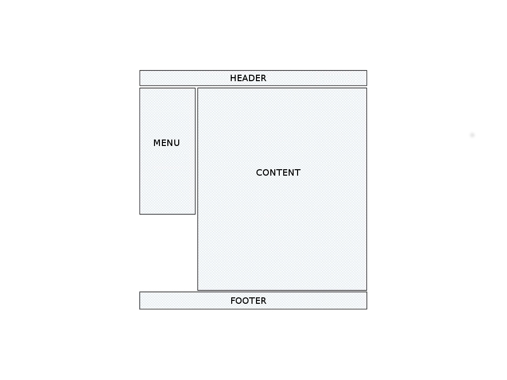
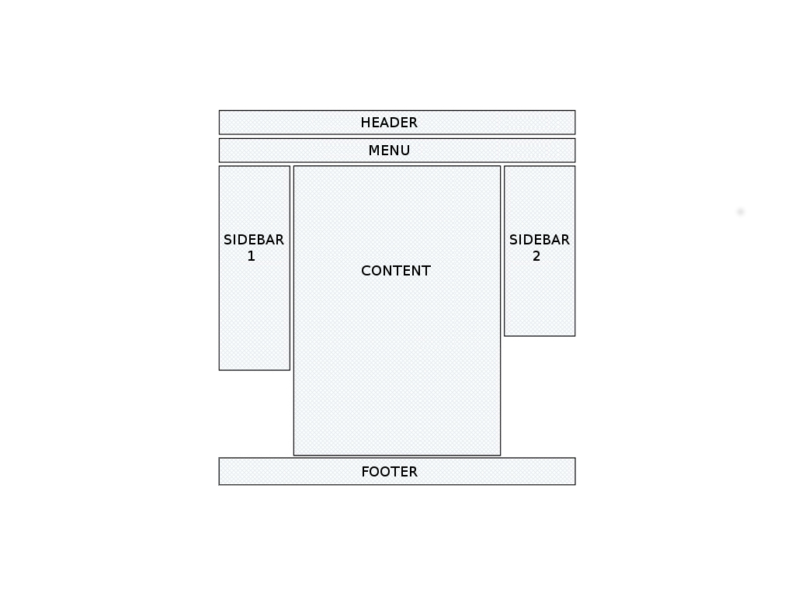

# 3 - Créer une mise en page

--------------------------------------------------------------------------------

# Un exemple de mise en page simple

.fx: imageslide

--------------------------------------------------------------------------------

# La propriété CSS float

Rappel : Pour réaliser la mise en page, nous utilisons des balises de type ``display: block``.

## La propriété CSS ``float``

Permet de spécifier si les éléments HTML suivants sont adjacents (et non les uns en dessous les autres)

    !css
    div {
        float: left | right | none;
    }

## Attention

Quand un élément a une propriété ``float``, on dit qu'il *sort du flux*: sa présence
n'est pas prise en compte par les autres éléments.

Pour éviter que l'élément suivant se superspose, il faut lui appliquer une marge.

--------------------------------------------------------------------------------

# La propriété CSS float

    !html
    

    
Bonjour le chat !

  

  
Bonjour le chat !

## À noter

* Les deux blocs sont l'un en dessous de l'autre.
* Les deux blocs prennent 100% de la largeur disponible

--------------------------------------------------------------------------------

# La propriété CSS float

    !html
    

    
Bonjour le chat !

&nbsp;

    !css
    #image {float: left;}
    #texte {margin-left: 200px;}

  

  
Bonjour le chat !

 

## À noter

* Le bloc ``#image`` flotte à gauche ;
* Le bloc ``#texte`` doit avoir une marge à gauche pour ne pas se superposer au bloc ``#image``.

--------------------------------------------------------------------------------

# La propriété CSS float

    !html
    

    
Bonjour le chat !

&nbsp;

    !css
    #image {float: right;}
    #texte {margin-right: 200px;}

  

  
Bonjour le chat !

 

## À noter

* Le bloc ``#image`` flotte à gauche ;
* Le bloc ``#texte`` doit avoir une marge à droite pour ne pas se superposer au bloc ``#image``.

--------------------------------------------------------------------------------

# La propriété CSS clear

Rappel: la propriété ``float`` permet de rendre tous les éléments HTML suivants adjacents.

## La propriété CSS ``clear``

Permet de spécifier les côtés d'un ou des éléments qui ne doivent pas être adjacents.

    !css
    div {
        float: left | right | both | none;
    }

Elle va notamment de mettre fin à l'effet d'une propriété ``float``.

--------------------------------------------------------------------------------

# La propriété CSS ``clear``

    !html
    

    
Bonjour le chat !

    
Comment ça va le chat ?

    
Passons à une discussion plus sérieuse ...

&nbsp;

    !css
    #image {float: left;}
    .texte {margin-left: 200px;}
    #suite {clear: both;}

  

  
Bonjour le chat !

  
Comment ça va le chat ?

  
Passons à une discussion plus sérieuse ...

--------------------------------------------------------------------------------

# Revenons à notre exemple

.fx: imageslide

--------------------------------------------------------------------------------

# Réalisation de ce premier exemple

## Méthodologie

1. Écrire le code HTML
2. Mettre en place le conteneur global (largeur)
3. Mettre en place l'affichage en deux colonnes pour la partie centrale
4. Dimensionner chaque bloc (largeur, hauteur si besoin)
5. Ajuster les marges

Conseil : Ajouter une bordure sur chaque bloc le temps du développement pour bien visualiser le rendu.

--------------------------------------------------------------------------------

# 1. Écriture du code HTML

Conseil : Encapsuler le tout dans un conteneur global.

    !html
    <html>
      <head>
        <title>Un premier layout</title>
        <link rel="stylesheet" href="stylesheet.css" />
      </head>
      <body>
        

          
HEADER

          
MENU

          
CONTENT

          
FOOTER

        
  
      

--------------------------------------------------------------------------------

# 2. Mise en place du conteneur global 

    !css
    #global {
      width: 1000px;
      margin: 0 auto 0 auto; 
    }

Note : Grâce aux marges gauche et droite en ``auto``, le conteneur global sera centré dans la fenêtre du navigateur.

--------------------------------------------------------------------------------

# 3. Mise en place de l'affichage en deux colonnes

    !css
    #menu {
      float: left;
      width: 300px; 
    }
    #content {
      margin-left: 310px;
    }
    #footer {
      clear: both;
    }

--------------------------------------------------------------------------------

# 4. Dimensionnement des différents blocs

    !css
    #header {
      height: 100px; 
    }
    #menu {
      height: 400px;
    }
    #footer {
      height: 100px;
    }

Note : On ne précise pas les largeurs de ``#header`` et ``#footer`` car ils prendront automatiquement toute la largeur disponible.

--------------------------------------------------------------------------------

# 5. Ajustement des marges

    !css
    #header {
      margin-bottom: 10px;
    }
    #footer {
      margin-top: 10px;
    }

--------------------------------------------------------------------------------

# Feuille de styles complète

    !css
    #global {
      width: 1000px; margin: 0 auto 0 auto;
    }
    #header {
      height: 100px; margin-bottom: 10px;
    }
    #menu {
      float: left; width: 300px; height: 400px;
    }
    #content {
      margin-left: 310px; height: 400px;
    }
    #footer {
      clear: both; height: 100px;
    }

--------------------------------------------------------------------------------

# Rendu

  

    
HEADER

    
MENU

    
CONTENT

    
FOOTER

  
  

--------------------------------------------------------------------------------

# TP : À vous !

.fx: imageslide

--------------------------------------------------------------------------------

# Mise en page fixe VS. Mise en page fluide

--------------------------------------------------------------------------------

## Mise en page fixe

Pour la première version de notre mise en page, nous avons dimensionné blocs et marges en **pixels**. Le résultat est une mise en page dite **fixe**, c'est à dire que la largeur ne s'adapte pas en fonction de la taille de la fenêtre.

## Mise en page fluide

En dimensionnant les largeurs de blocs et de marges en **pourcentages**, la mise en page sera **fluide**, elle s'adaptera à la largeur de la fenêtre. 

## Pixels vs. poucentages

Utiliser une combinaison de pixels et de pourcentages est fortement déconseillé. Exemples de ce qu'il ne faut pas faire :

* largeurs de blocs en pixels et marges en pourcentages ;
* largeurs des barres latérales en pourcentages et largeur du contenu central en pixels.

--------------------------------------------------------------------------------

# TP : À vous !

.fx: imageslide
