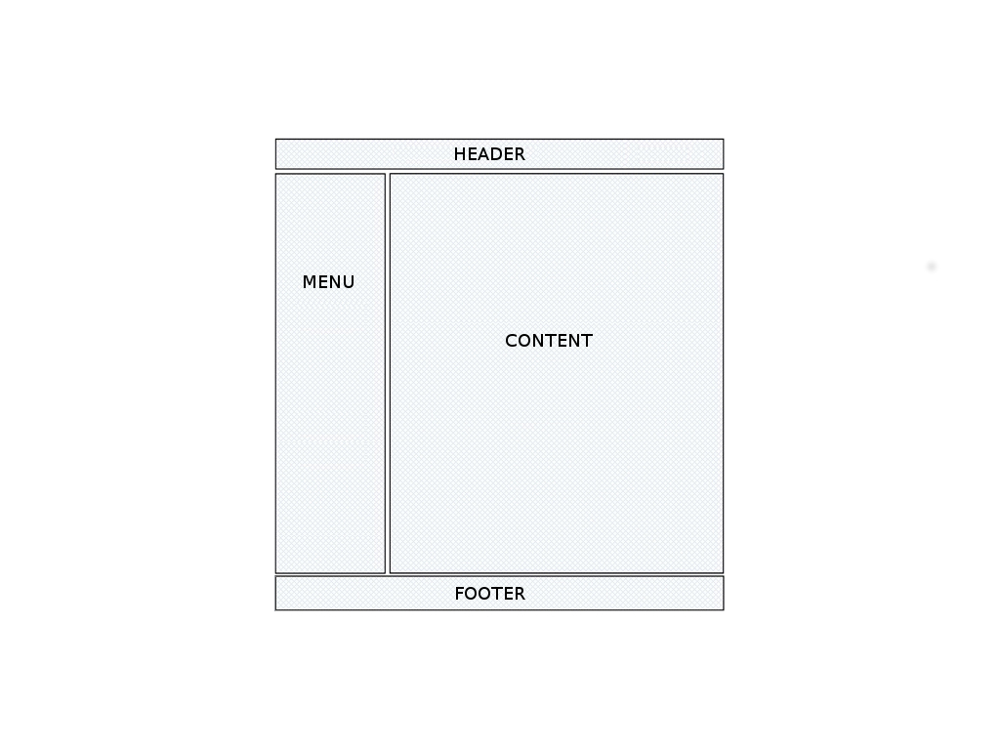
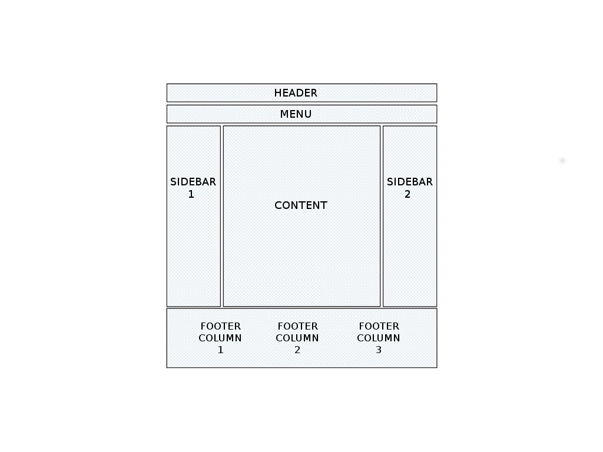

# 4 - Les tableaux

--------------------------------------------------------------------------------

# Introduction

L'objectif des tableaux est de présenter des *données tabulaires* structurées en lignes et colonnes, comme dans un tableur tel qu'OpenOffice Calc ou Microsoft Excel.

# Les balises relatives aux tableaux

* ``<table>`` : Définit un tableau
* ``<caption>`` : Encadre le titre du tableau
* ``<tr>`` : Crée une nouvelle ligne dans un tableau (tr = *table row*)
* ``<th>`` : Crée une cellule d'entête dans une ligne de tableau (th = *table header*)
* ``<td>`` : Crée une cellule classique dans une ligne de tableau (td = *table data*)

--------------------------------------------------------------------------------

# Exemple

    !html
    <table>
      <caption>Communes de la métropole nantaise</caption>
      <tr>
        <th>Commune</th>
        <th>Code postal</th>
        <th>Population (2009)</th>
      </tr>
      <tr>
        <td>Nantes</td>
        <td>44000</td>
        <td>282 047</td>
      </tr>
      <tr>
        <td>Carquefou</td>
        <td>44470</td>
        <td>17 772</td>
      </tr>
    </table>

--------------------------------------------------------------------------------

## Un peu de CSS pour la mise en forme

    !css
    caption {
        font-style: italic;
    }
    th {
      text-align: center;
    }
    td, th {
        border: 1px solid white;
        padding: 5px;
    }

## Rendu

<table class="extable">
  <caption>Liste des communes de la métropole nantaise</caption>
  <tr>
    <th>Commune</th>
    <th>Code postal</th>
    <th>Population (2009)</th>
  </tr>
  <tr>
    <td>Nantes</td>
    <td>44000</td>
    <td>282 047</td>
  </tr>
  <tr>
    <td>Carquefou</td>
    <td>44470</td>
    <td>17 772</td>
  </tr>
</table>

--------------------------------------------------------------------------------

# À vous !

<table class="extable">
  <caption>Spécification ordinateur portable</caption>
  <tr>
    <th>Caractéristique</td>
    <th>Valeur</th>
  </tr>
  <tr>
    <td>Processeur</th>
    <td>Intel core i7</td>
  </tr>
  <tr>
    <td>Mémoire</th>
    <td>4Go RAM</td>
  </tr>
  <tr>
    <td>Poids</th>
    <td>1,250kg</td>
  </tr>
  <tr>
    <td>Couleur</th>
    <td>Noir</td>
  </tr>
</table>

--------------------------------------------------------------------------------

# Fusionner des colonnes

L'attribut ``colspan`` permet de fusionner plusieurs colonnes au niveau d'une ligne. La valeur donnée correspond au nombre de colonnes à fusionner.

## Exemple

    !html
    <table>
      <tr>
        <td>A</td>
        <td>B</td>
        <td>C</td>
      </tr>
      <tr>
        <td colspan="2">1</td>
        <td>2</td>
      </tr>
    </table>

--------------------------------------------------------------------------------

# Fusionner des colonnes

<table class="extable">
  <tr>
    <td>A</td>
    <td>B</td>
    <td>C</td>
  </tr>
  <tr>
    <td colspan="2">1</td>
    <td>2</td>
  </tr>
</table>

--------------------------------------------------------------------------------

# Fusionner des lignes

L'attribut ``rowspan`` permet de fusionner plusieurs lignes au niveau d'une colonne. La valeur donnée correspond au nombre de lignes à fusionner.

## Exemple

    !html
    <table class="extable">
      <tr>
        <td rowspan="2">1</td>
        <td>A</td>
      </tr>
      <tr>
        <td>B</td>
      </tr>
      <tr>
        <td>2</td>
        <td>C</td>
      </tr>
    </table>

--------------------------------------------------------------------------------

# Fusionner des lignes

<table class="extable">
  <tr>
    <td rowspan="2">1</td>
    <td>A</td>
  </tr>
  <tr>
    <td>B</td>
  </tr>
  <tr>
    <td>2</td>
    <td>C</td>
  </tr>
</table>

--------------------------------------------------------------------------------

# À vous !

<table class="extable extable-final">
  <tr>
    <td colspan="2" rowspan="2"></td>
    <th colspan="2">Individuel</th>
    <th colspan="2">Entreprise</th>
  </tr>
  <tr>
    <th class="level2">Mini</th>
    <th class="level2">Perso</th>
    <th class="level2">Premium</th>
    <th class="level2">Platinium</th>
  </tr>
  <tr>
    <th rowspan="2">Fonctionnalités</th>
    <th class="level2">Comptes</th>
    <td>1</td>
    <td>1</td>
    <td>10</td>
    <td>100</td>
  </tr>
  <tr>
    <th class="level2">Stockage</th>
    <td>10Go</td>
    <td>100Go</td>
    <td>50Go / util.</td>
    <td>500Go / util.</td>
  </tr>  
  <tr>
    <th rowspan="2">Tarifs</th>
    <th class="level2">Mensuel</th>
    <td>10€</td>
    <td>100€</td>
    <td>30€</td>
    <td>300€</td>
  </tr>  
  <tr>
    <th class="level2">Annuel</th>
    <td>80€</td>
    <td>800€</td>
    <td>280€</td>
    <td>2800€</td>
  </tr>  
</table>

--------------------------------------------------------------------------------

# Utilisation des tableaux

## Quand utiliser un tableau

Il faut penser à la **sémantique** du code HTML : ``<table>`` = tableau !

On utilise donc un tableau pour afficher des **données tabulaires**. Exemple :

* Tableau de prix
* Statistiques
* ...

## Quand ne pas utiliser un tableau

On n'utilise pas un tableau pour faire de la mise en page. C'est une méthode obsolète à bannir.

* Ce n'est pas responsive
* On ne peut pas modifier la mise en page avec du CSS

--------------------------------------------------------------------------------

# Mise en page en tableau, méthode obsolète

    !html
    <html>
      <body>
        <table>
          <tr>
            <td>HEADER</th>
          </tr>
          <tr>
            <td>MENU</td>
            <td>CONTENT</td>
          </tr>
          <tr>
            <td>FOOTER</td>
          </tr>
        </table>
      </body>
    </html>

--------------------------------------------------------------------------------

# Grâce à CSS, une nouvelle méthode

--------------------------------------------------------------------------------

# Retour de la propriété ``display``

La propriété ``display`` permet de simuler l'affichage en tableau grâce plusieurs valeur : ``table``, ``table-caption``, ``table-cell``, ...

* ``display: table`` : permet à un élément de se comporter comme un tableau
* ``display: table-row`` : permet à un élément de se comporter comme une ligne de tableau
* ``display: table-cell`` : permet à un élément de se comporter comme une cellule de tableau 
* ...

--------------------------------------------------------------------------------

# Exemple

    !html
    <html>
      <body>
        
HEADER

        

          
MENU

          
CONTENT

        

        

        
FOOTER

      </body>
    </html>

&nbsp;

    !css
    #main { display: table; }
    #menu { display: table-cell; }
    #content { display: table-cell; }

--------------------------------------------------------------------------------

# Rendu

.fx: imageslide

--------------------------------------------------------------------------------

# Avantages

## Par rapport à la méthode obsolète avec ``table``

* Le code HTML reste simple et souple
* On peut changer la mise en page avec du CSS, par exemple :
    * passer le menu à droite plutôt qu'à gauche
    * transformer le menu vertical en menu horizontal au dessus du contenu
    * ...
* On ne va pas à l'encontre de la sémantique des balises HTML

## Par rapport à l'utilisation de ``float``

* Les éléments ne sortent pas du flux HTML
    * Pas de problème de marges
    * Pas de problème de conteneurs vides

--------------------------------------------------------------------------------

# TP : À vous !

.fx: imageslide
