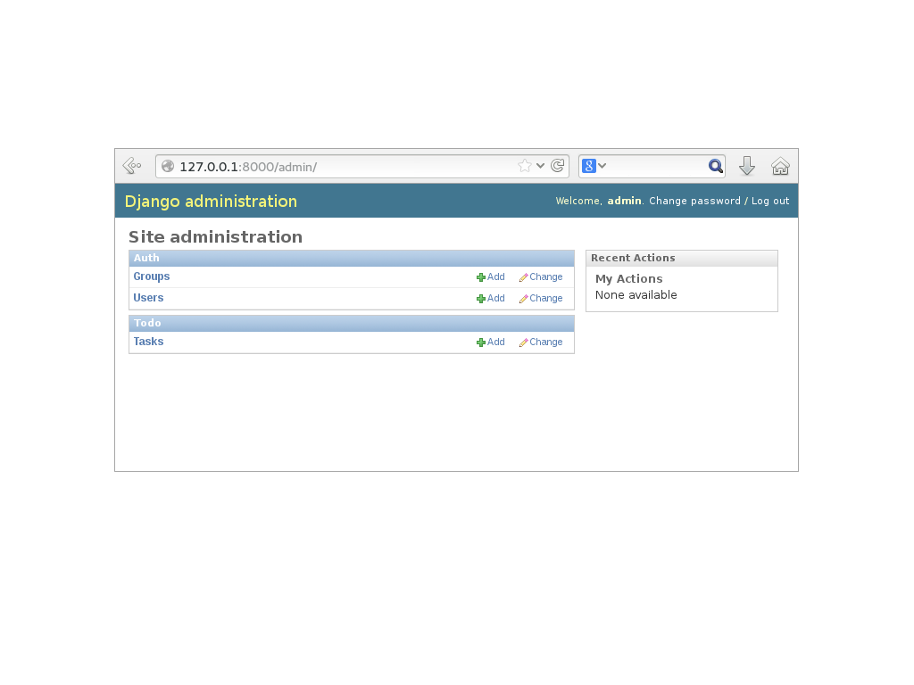

# todoproject à Django

--------------------------------------------------------------------------------

> La Plateforme de développement Web pour les perfectionnistes sous pression.

<cite> — www.django-fr.org</cite>

.fx: quoteslide

--------------------------------------------------------------------------------

# Qu'est-ce-que Django

* Django est un framework en Python pour le Web qui encourage le développement rapide et propre avec une conception pragmatique
* Django permet de construite des applications web rapidement et avec peu de code
* Malgré son haut niveau d'abstraction, il est toujours possible de descendre dans les couches

## Historique

* Créé en 2003, basé sur le langage Python créé en 1990
* Rendu Open Source (BSD) en 2005
* Version actuelle : Django 1.6, sortie en novembre 2013
* Aujourd'hui utilisé par de très nombreuses entreprises : Mozilla, Instagram, Pinterest, Disqus, ...

--------------------------------------------------------------------------------

# Philosophie

## KISS (*Keep It Simple, Stupid*)

> Simplicity should be a key goal in design and unnecessary complexity should be avoided.

## DRY (*Don't Repeat Yourself*)

> Every piece of knowledge must have a single, unambiguous, authoritative representation within a system.

## Conventions de codage

La documentation précise certaines conventions de codage spécifiques à Django. La PEP 8 fait référence pour le reste.

--------------------------------------------------------------------------------

# 10 raisons d'utiliser Django

* Facile à installer
* Fonction *out of the box*
* Excellente documentation
* Modèles en Python et ORM efficace (peu de connaissances SQL requises)
* Interface d'administration auto-générée
* Architecture *pluggable*, nombreux modules existants
* Gestion de formulaires
* Serveur de développement *standalone*
* Déploiement facile
* Excellente communauté autour du projet

--------------------------------------------------------------------------------

# Environnement

* Django 1.6
* Python : 2.6 / 2.7 / 3.2 / 3.3
* Base de données : SQLite, PostgreSQL, MySQL
* Il est préférable de travailler dans un *virtualenv*

--------------------------------------------------------------------------------

# Architecture MVC, ou plutôt MTV

L'architecture de Django s'inspire du principe MVC (*Model, View, Controller*) ou plutôt MTV (*Model, Template, View*) :

* **Model** : Les modèles sont écrits en Python et Django fournit un ORM (*Django ORM*) complet pour accéder à la base de données
* **Template** : Django possède son propre moteur de template (*Django Template Engine*)
* **View** : Les vues Django peuvent être de simples fonctions Python retournant des réponses HTTP ou être basées sur des classes

La fonction **controller** est gérée par l'*URL dispatcher* qui permet de faire correspondre des URLs sous forme d'expressions régulières à des vues.

--------------------------------------------------------------------------------

# Tutoriel fil rouge : une gestion de *Todo lists*

--------------------------------------------------------------------------------

# Installer Django

## Création et activation du *virtualenv*

    !console
    $ virtualenv --no-site-packages venv_todoproject
    $ source venv_todoproject/bin/activate

## Installation de Django

    !console
    $ pip install django==1.6

## Création du projet

    !console
    $ django-admin.py startproject todoproject

## Lancement du serveur de développement

    !console
    $ cd todoproject
    $ ./manage.py runserver

--------------------------------------------------------------------------------

# It worked !

.fx: imageslide

--------------------------------------------------------------------------------

# Le projet créé

    !console
    ├── todoproject
    │   ├── manage.py
    │   └── todoproject
    │       ├── __init__.py
    │       ├── settings.py
    │       ├── urls.py
    │       └── wsgi.py

* ``/todoproject`` : conteneur du projet (le nom est sans importance)
* ``/manage.py`` : utilitaire en ligne de commande permettant différentes action sur le projet
* ``/todoproject/todoproject`` : paquet Python effectif du projet
* ``/todoproject/settings.py`` : réglages et configuration du projet
* ``/todoproject/urls.py`` : déclaration des URLs du projet
* ``/todoproject/wsgi.py`` : point d'entrée pour déployer du projet avec WSGI

--------------------------------------------------------------------------------

# Accès à la base de données
Django propose une configuration par défaut pour une base SQLite (cf : ``settings.py``).

Voici un exemple de configuration pour une base Postgresql :

    !python
    DATABASES = {
      'default': {
        'ENGINE': 'django.db.backends.postgresql_psycopg2',
        'NAME': 'todoproject_db',
        'USER': 'todoproject_user',
        'PASSWORD': 'Cx12%a03oa',
        'HOST': 'localhost'
      }
    }

## Création de la base de données

    !console
    $ ./manage.py syncdb

--------------------------------------------------------------------------------

# Projet vs. Application

Il est important de différencier la notion de **projet** et d'**application**.

## Une application

> Une application est une application Web qui fait quelque chose – par exemple un système de blog, une base de données publique ou une application de sondage

## Un projet

> Un projet est un ensemble de réglages et d’applications pour un site Web particulier.

## Projets et applications

> Un projet peut contenir plusieurs applications. Une application peut apparaître dans plusieurs projets.

<cite> — docs.djangoproject.com</cite>

--------------------------------------------------------------------------------

# Création d'une application

    !console
    $ ./manage.py startapp todo

## L'application créée

    !console
     ├── todo
     │   ├── admin.py
     │   ├── __init__.py
     │   ├── models.py
     │   ├── tests.py
     │   └── views.py

* ``models.py`` : déclaration des modèles de l'application
* ``views.py`` : écriture des vues de l'application
* ``admin.py`` : comportement de l'application dans l'interface d'administration
* ``tests.py`` : Il. Faut. Tester.

--------------------------------------------------------------------------------

# Les modèles

--------------------------------------------------------------------------------

# Déclaration d'un modèle

    !python
    # models.py
    from django.db import models

    class Task(models.Model):
        name = models.CharField(max_length=100)
        deadline = models.DateField(blank=True, null=True)
        done = models.BooleanField(default=False)

--------------------------------------------------------------------------------

# Quelques options pour les modèles

L'ajout de la classe``Meta`` dans un modèle permet de déclarer des *options de métadonnées* sur le modèle. Exemple :

    !python
    class Meta:
        db_table = 'task'
        verbose_name = 'Task'
        verbose_name_plural = 'Tasks'
        ordering = ('-deadline', )

D'autres options permettent par exemple de :

* rendre le modèle abstrait
* demander à Django de ne pas gérer ce modèle en base de données
* de préciser des critères de tri
* de déclarer des permissions relatives au modèle
* ...

--------------------------------------------------------------------------------

# Quelques options pour les champs

Chaque type de champ possède ces propres propriétés. Cependant, certaines sont communes et souvent utilisées comme : 

* ``verbose_name``: label du champ
* ``null`` : valeur NULL autorisée ou non en base de données
* ``blank`` : valeur vide autorisée ou non en base de données
* ``default`` : valeur par défaut pour une nouvelle instance
* ``editable`` : le champ doit-il apparaître automatiquement dans les formulaires
* ...

--------------------------------------------------------------------------------

# Activation de l'application

## Déclaration de l'application dans les *settings*

    !python
    # settings.py
    INSTALLED_APPS = (
      'django.contrib.admin',
      ...
      'todo',
    )

## Création de la table en base de données

    !console
    $ ./manage.py syncdb

## Déclaration dans l'interface d'administration

    !python
    # admin.py
    from django.contrib import admin
    from todo.models import Task

    admin.site.register(Task)

--------------------------------------------------------------------------------

# L'interface d'administration Django

.fx: imageslide

--------------------------------------------------------------------------------

# Les vues

--------------------------------------------------------------------------------

