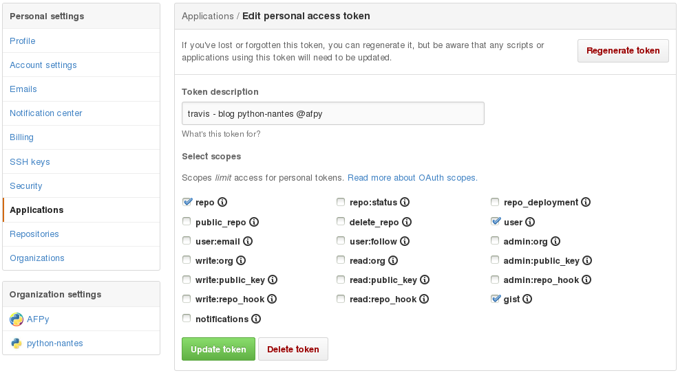

# Déployer un site Pelican sur Github-pages avec Travis

--------------------------------------------------------------------------------

## Qui suis-je ?

* Développeur / Chef de projet chez Makina Corpus
* Formateur au Cnam

## Que fais-je ?

* Du développement d'applications métiers avec Python & Django
* Un peu de front-end
* De la formation en développement web

## Où suis-je

* <a href="http://fle.github.io">``http://fle.github.io``</a>
* <a href="http://twitter.com/__fle__">``http://twitter.com/__fle__``</a>

--------------------------------------------------------------------------------

## Objectifs

* Se simplifier la gestion du site (merci Pelican !)
* Se simplifier l'hébergement du site (merci Github !)
* Se simplifier le déploiement du site (merci Travis CI !)

## Objectif principal

* Publier un article doit se limiter à un ``git push``

## Solution

* À chaque push, demander à Travis CI de lancer la génération du site Pelican
et de pousser le résultat sur une branche ``gh-pages`` du repos Github !

--------------------------------------------------------------------------------

# Makefile

Adaptation du Makefile Pelican

	!basemake
	github: publish
	  ghp-import -n $(OUTPUTDIR)
  	  @git push -fq https://${GH_TOKEN}@github.com/$(TRAVIS_REPO_SLUG).git gh-pages > /dev/null

--------------------------------------------------------------------------------

# Configuration Travis

Ajout d'un fichier .travis.yml à la racine du projet

    !basemake
	language: python
	branches:
	  only:
	  - master
	install:
	  - pip install pelican ghp-import
	script:
	  - make publish github

--------------------------------------------------------------------------------

# Authentification Travis CI / Github

Génération d'un token via la page *GitHub applications*

--------------------------------------------------------------------------------

# Authentification Travis CI / Github

Chiffrement du token

	!console
	$ sudo apt-get install ruby1.9.1-dev build-essentials
	$ sudo gem install travis

	$ travis encrypt GH_TOKEN=your_token

Ajout du token au fichier .travis.yml

    !basemake
	language: python
	branches:
	  only:
	  - master
	install:
	  - pip install pelican ghp-import
	script:
	  - make publish github
	env:
	  global:
	    secure: vBsIJ............30egG7FO4CUo0rQ=

--------------------------------------------------------------------------------

# Détails supplémentaires

--------------------------------------------------------------------------------

# Page projet vs. Page compte

## Page projet

* Mettre les sources Pelican sur **master**
* Pousser le site généré sur **gh-pages**

## Page compte

* Mettre les sources Pelican sur **content** (ou n'importe quoi d'autre)
* Pousser le site généré sur **master**

Attention à bien utiliser les bonnes branches et à adapter le Makefile !

--------------------------------------------------------------------------------

# Nom de domaine personnalisé

Par défaut, le nom domaine pour accéder au site sera *compte.github.io* ou *compte.github.io/project* mais il est possible de faire pointer un nom de domaine personnalisé (cf la doc : <a href="https://help.github.com/articles/setting-up-a-custom-domain-with-github-pages/">``https://help.github.com``</a>).

Ajout d'un alias chez votre registrar

Ajout d'un fichier CNAME (ex de path: ``extra/CNAME``)
	
	!console
	nantes.afpy.org

Adaptation des settings Pelican

	!python
	
	STATIC_PATHS = ['extra/CNAME']
	
	EXTRA_PATH_METADATA = {'extra/CNAME': {'path': 'CNAME'}}

--------------------------------------------------------------------------------

# Sources

* <a href="http://blog.mathieu-leplatre.info/publish-your-pelican-blog-on-github-pages-via-travis-ci.html">Publish your Pelican blog on Github pages via Travis CI (Mathieu Leplatre)</a>

--------------------------------------------------------------------------------

