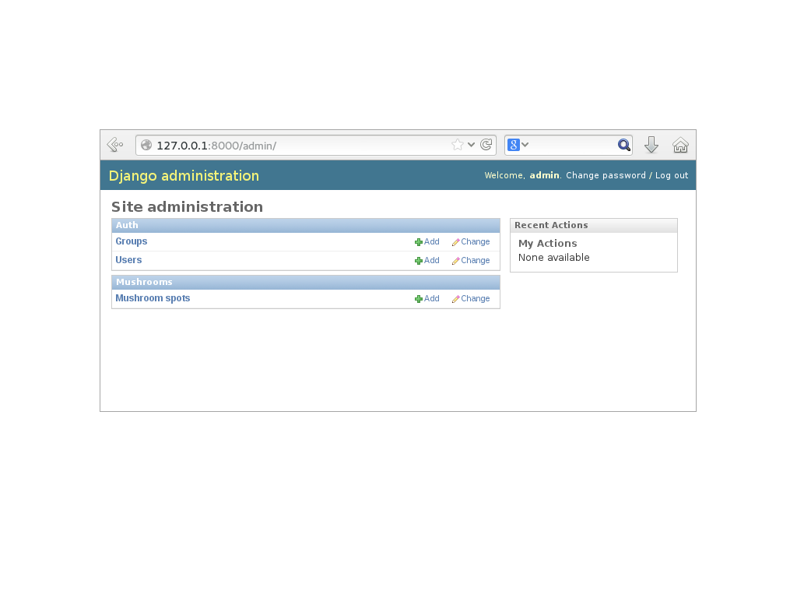

# Introduction à Django

--------------------------------------------------------------------------------

## Qui suis-je ?

* Développeur / Chef de projet chez Makina Corpus
* Formateur au Cnam

## Que fais-je ?

* Du développement d'applications métiers avec Python & Django
* Un peu de front-end
* De la formation en développement web

## Où suis-je

* <a href="http://fle.github.io">``http://fle.github.io``</a>
* <a href="http://twitter.com/__fle__">``http://twitter.com/__fle__``</a>

--------------------------------------------------------------------------------

## Python Nantes, 4e meetup & des news

## Le twitter !

* Suivez et diffusez : <a href="https://twitter.com/PythonNantes">@PythonNantes</a> 

## La mailing-list !

* Inscrivez-vous sur <a href="http://lists.afpy.org/listinfo/nantes">``http://lists.afpy.org/listinfo/nantes``</a> pour participer aux discussions concernant l'organisation des meetups.

## Le blog !

* Retrouvez les annonces et comptes-rendus de meetups sur <a href="http://nantes.afpy.org">``http://nantes.afpy.org``</a>.
* À propos ... **qui s'y colle aujourd'hui ?**

--------------------------------------------------------------------------------

> La Plateforme de développement Web pour les perfectionnistes sous pression.

<cite> — www.django-fr.org</cite>

.fx: quoteslide

--------------------------------------------------------------------------------

# Qu'est-ce-que Django ?

* Django est un framework en Python pour le Web qui encourage le développement rapide et propre avec une conception pragmatique
* Django permet de construire des applications web rapidement et avec peu de code
* Malgré son haut niveau d'abstraction, il est toujours possible de descendre dans les couches

## Historique

* Créé en 2003, basé sur le langage Python créé en 1990
* Rendu Open Source (BSD) en 2005
* Version actuelle : Django 1.6, sortie en novembre 2013 (1.7 en RC)
* Aujourd'hui utilisé par de très nombreuses entreprises : Mozilla, Instagram, Pinterest, Disqus, ...

--------------------------------------------------------------------------------

# Philosophie

## KISS (*Keep It Simple, Stupid*)

> Simplicity should be a key goal in design and unnecessary complexity should be avoided.

## DRY (*Don't Repeat Yourself*)

> Every piece of knowledge must have a single, unambiguous, authoritative representation within a system.

## Conventions de codage

La documentation précise certaines conventions de codage spécifiques à Django. La PEP 8 fait référence pour le reste.

--------------------------------------------------------------------------------

# 10 raisons d'utiliser Django

* Facile à installer
* Fonctionne *out of the box*
* Excellente documentation
* Modèles en Python et ORM efficace (peu de connaissances SQL requises)
* Interface d'administration auto-générée
* Architecture *pluggable*, nombreux modules existants
* Gestion de formulaires
* Serveur de développement *standalone*
* Déploiement facile
* Communauté autour du projet très active

--------------------------------------------------------------------------------

# Environnement

* Django : 1.6
* Python : 2.6 / 2.7 / 3.2 / 3.3
* Base de données : SQLite, PostgreSQL, MySQL
* Il est préférable de travailler dans un environnement virtualisé (*virtualenv*)

# En production

* Derrière Apache, nginx, ...
* Avec mod_wsgi, uWSGI, gunicorn, ...

--------------------------------------------------------------------------------

# Architecture MVC, ou plutôt MTV

L'architecture de Django s'inspire du principe MVC (*Model, View, Controller*) ou plutôt MTV (*Model, Template, View*) :

* **Model** : Un modèle est écrit en Python et Django fournit un ORM (*Django ORM*) complet pour accéder à la base de données
* **Template** : Django possède son propre moteur de template (*Django Template Engine*)
* **View** : Une vue Django définit quelles données sont présentées à l'utilisateur. Une vue peut être une simple fonction Python retournant une réponse HTTP ou être basée sur une classe

La fonction correspondant au **controller** est assumée par l'*URL dispatcher* qui permet de faire correspondre des URLs sous forme d'expressions régulières à des vues.

--------------------------------------------------------------------------------

# Un premier projet pas à pas ...

--------------------------------------------------------------------------------

# 1. Un projet

--------------------------------------------------------------------------------

# Installer Django

## Création et activation de l'environnement virtuel

    !console
    $ virtualenv --no-site-packages venv_mushroomproject
    $ source venv_mushroomproject/bin/activate

## Installation de Django

    !console
    $ pip install django==1.6

## Création du projet

    !console
    $ django-admin.py startproject mushroomproject

## Lancement du serveur de développement

    !console
    $ cd mushroomproject
    $ ./manage.py runserver

--------------------------------------------------------------------------------

# It worked !

.fx: imageslide

--------------------------------------------------------------------------------

# Le projet créé

    !console
    ├── mushroomproject
    │   ├── manage.py
    │   └── mushroomproject
    │       ├── __init__.py
    │       ├── settings.py
    │       ├── urls.py
    │       └── wsgi.py

* ``/mushroomproject`` : conteneur du projet (le nom est sans importance)
* ``/manage.py`` : utilitaire en ligne de commande permettant différentes actions sur le projet
* ``/mushroomproject/mushroomproject`` : paquet Python effectif du projet
* ``/mushroomproject/settings.py`` : réglages et configuration du projet
* ``/mushroomproject/urls.py`` : déclaration des URLs du projet
* ``/mushroomproject/wsgi.py`` : point d'entrée pour déployer le projet avec WSGI

--------------------------------------------------------------------------------

# 2. Une application

--------------------------------------------------------------------------------

# Créer une application

    !console
    $ ./manage.py startapp mushrooms

## L'application créée

    !console
     ├── mushrooms
     │   ├── admin.py
     │   ├── __init__.py
     │   ├── models.py
     │   ├── tests.py
     │   └── views.py

* ``models.py`` : déclaration des modèles de l'application
* ``views.py`` : écriture des vues de l'application
* ``admin.py`` : comportement de l'application dans l'interface d'administration
* ``tests.py`` : Il. Faut. Tester.

--------------------------------------------------------------------------------

# 3. Un modèle

--------------------------------------------------------------------------------

# Déclarer un modèle

    !python
    # mushrooms/models.py
    from django.db import models

    class MushroomSpot(models.Model):
        specy = models.CharField(max_length=100)
        location = models.CharField(max_length=200)
        discovery = models.DateField(blank=True, null=True)
        famous = models.BooleanField(default=False)
        picture = models.FileField(upload_to='pictures')

        class Meta:
            db_table = 'mushroom_spot'
            verbose_name = 'Mushroom spot'
            verbose_name_plural = 'Mushroom spots'
            ordering = ('-discovery', )

        def __str__(self):
            return '{}/{}'.format(self.specy, self.location)

--------------------------------------------------------------------------------

# Activer de l'application

## Déclaration de l'application dans les *settings*

    !python
    # settings.py
    INSTALLED_APPS = (
      'django.contrib.admin',
      ...
      'mushrooms')

## Création des tables en base de données

    !console
    $ ./manage.py syncdb

## Déclaration dans l'interface d'administration

    !python
    # mushrooms/admin.py
    from django.contrib import admin
    from mushrooms.models import MushroomSpot

    admin.site.register(MushroomSpot)

--------------------------------------------------------------------------------

# L'interface d'administration Django

.fx: imageslide

--------------------------------------------------------------------------------

# 4. Une vue

--------------------------------------------------------------------------------

# Écrire une vue
    
    !python
    # mushrooms/views.py
    from django.shortcuts import render
    from mushrooms.models import MushroomSpot

    def mushroom_spot_list(request):

        # Requête via l'ORM
        mushroom_spots = MushroomSpot.objects.all()

        # Variables passées au template
        context = {
            'mushroom_spots': mushroom_spots
        }
    
        return render(
            request,
            'mushrooms/mushroom_spot_list.html',
            context
        )

--------------------------------------------------------------------------------

# 5. Un template

--------------------------------------------------------------------------------

# Écrire un template

    !html
    {# mushrooms/templates/mushrooms/mushroom_spot_list.html #}
    
    
    <h1>Liste des coins à champignons</h1>
    
    
    
    
        <ul>
            
            <li>{{ spot }}</li>
            
        </ul>
    
    
    
        
Aucun coin :( !

    
    

--------------------------------------------------------------------------------

# 6. Une URL

--------------------------------------------------------------------------------

# 6. Déclarer une URL

    !python
    # mushrooms/urls.py
    from django.conf.urls import patterns, url
    
    urlpatterns = patterns('',
        ...
    
        url(r'^mushroom_spot/list/$',
            'mushrooms.views.mushroom_spot_list',
            name='mushroom_spot_list'),
    
        ...
    )

--------------------------------------------------------------------------------

# Démo

--------------------------------------------------------------------------------

# Aller plus loin ...

--------------------------------------------------------------------------------

# Aller plus loin avec ces concepts

* Les modèles : Relations 1-1 / 1-N / N-N, héritage
* Les vues : Vues basées sur une fonction / sur une classe
* Les templates : inclusion & héritage, filtres & tags
* Les URLs : passage d'arguments, internationalisation
* L'ORM : managers, querysets
* L'interface d'administration : complètement personnalisable

--------------------------------------------------------------------------------

# Autres concepts

* Les formulaires : formulaires classiques / basés sur un modèle, formsets
* L'internationalisation : i18n, l10n, timezones
* L'authentification : ACL, backend d'authentitification, modèle utilisateur remplaçable
* Les commandes d'administration
* Les middlewares
* Les signaux
* La gestion du cache
* Le framework de tests

--------------------------------------------------------------------------------

# Pour finir ...

--------------------------------------------------------------------------------

# Quelques modules indispensables

## Gestion de la base de données
* ``south`` : migration de schéma et de données de base de données

## Outils
* ``django_extensions`` : plusieurs extensions et outils d'administration très pratiques
* ``django_debug_toolbar`` : une barre latérale permettant de faire du *debug* et du *profiling* page par page

# Tests
* ``factory_boy`` : création de grappes de données pour les tests
* ``django_jenkins`` : intégration à Jenkins

--------------------------------------------------------------------------------

# Quelques modules souvent utilisés

* ``django_compressor`` : compression des fichiers statiques
* ``django_floppyforms`` : mise en forme de formulaires
* ``django_linaration_pagination`` : affichage de listes paginées
* ``django_sorting`` : affichage de tableaux triables
* ``django_breadcrumbs`` : création de fil d'ariane
* ``django_xworkflows`` : gestion de workflows
* ``django_modeltranslation`` : gestion de modèles multilingues
* ``easy_thumbnails`` : gestion de miniatures pour les images
* ``django_tinymce`` : intégration d'un *widget* TinyMCE

Un répertoire de modules : <a href="https://www.djangopackages.com">``https://www.djangopackages.com``</a>

--------------------------------------------------------------------------------

# Où obtenir des informations ?

## Les sites
* http://www.djangoproject.com [EN]
* http://www.django-fr.org/ [FR]

## Les planètes
* http://www.planetdjango.org/ [EN]
* http://www.django-fr.org/planete/ [FR]

## Les outils de développement
* Le *bug tracker* : http://code.djangoproject.com
* Le Jenkins : http://ci.djangoproject.com/

--------------------------------------------------------------------------------

# La communauté Django

## Contacts

* La *mailing list* Django : django@lists.afpy.org
* Les *channels* IRC : #django, #django-fr
* Le forum français : http://forum.django-fr.org

## Événements

* Meetups nantais :)
* Djangocong : Conférence annuelle française
* Djangocon-eu : Conférence annuelle européenne
* D'autres Djangocon un peu partout dans le monde

--------------------------------------------------------------------------------

# Merci !

* Les slides de ce talk via twitter : <a href="http://twitter.com/__fle__">``@__fle__``</a> ou <a href="http://twitter.com/PythonNantes">``@PythonNantes``</a>
