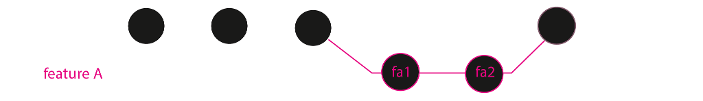
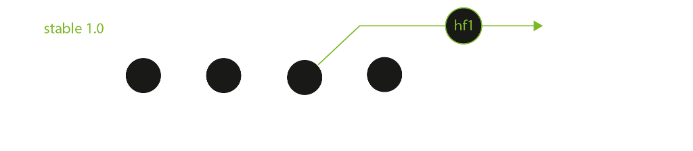
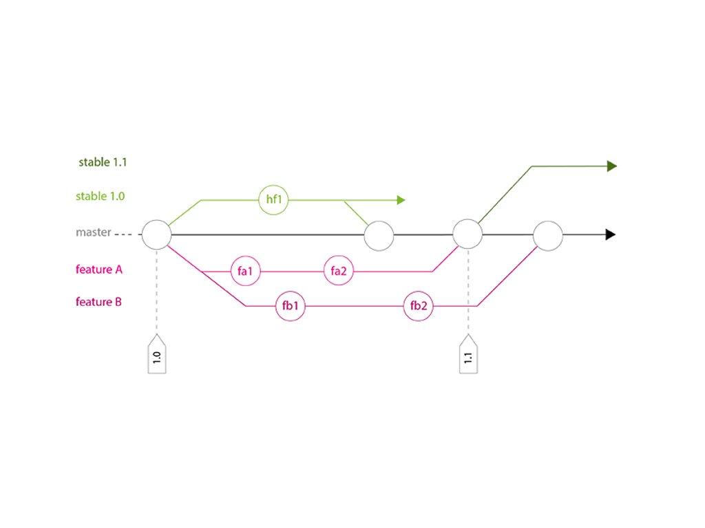

# GIT : Un workflow efficace pour les projets à moyen/long terme

--------------------------------------------------------------------------------

## Qui suis-je ?

* Développeur Python / Django chez Makina Corpus

* Mainteneur du codebase et des releases

* Formateur chez Makina Corpus et au Cnam

## Où suis-je

* ``http://fle.github.io``

* ``http://twitter.com/__fle__``

--------------------------------------------------------------------------------

# Git et ses avantages

Git est un logiciel de gestion de versions disposant de nombreux avantages :

* Gestion décentralisée

* Gestion de branches simple et efficace

* De multiples commandes et options très pratiques

* Interface en ligne de commande riche

* Github - Gitlab / Gitorious / ...

--------------------------------------------------------------------------------

# Trouver un workflow qui correspond au contexte du projet

--------------------------------------------------------------------------------

# Contexte

* Plusieurs développeurs

* Plusieurs instances de pré-production, plusieurs serveurs de production (versions de code non synchrones)

* Releases mensuelles avec livraison en pré-production, puis sur le(s) serveur(s) de production

* Sur les serveurs, la base de code est récupérée depuis le dépôt Git avec Fabric

--------------------------------------------------------------------------------

# Quelques règles

1. Un (et un seul) mainteneur, qui gère le dépôt Git et les releases

2. Ne jamais commiter directement sur la branche master

3. Ne jamais faire de rebase de master sur une autre branche

4. Ne pas sortir du workflow prévu

--------------------------------------------------------------------------------

# Branche master

* Contient toute la base de code de la prochaine release

* Évolue exclusivement par des commits de merge

* Est en permanence fonctionnelle et fiable

--------------------------------------------------------------------------------

# Branches de développement

``1.`` Nouvelle fonctionnalité ou correction de bug = nouvelle branche depuis master/HEAD

    !console    
    
    $ (master) git checkout -b featureA
    $ (featureA) git commit -a -m "featureA part 1"
    $ (featureA) git commit -a -m "featureA part 2"

``2.`` Suivi de l'évolution de master et vérification régulière que le code fonctionne

    !console    
    
    $ (featureA) git rebase master

--------------------------------------------------------------------------------

# Branches de développement

``3.`` Dernier rebase à la fin des développements de la branche pour :

* s'assurer que le mainteneur pourra merger son code facilement
* s'assurer que la branche master est toujours pleinement fonctionnelle

``4.`` Merge de la branche de développement sur master par le mainteneur

    !console
    $ (master) git merge --no-ff featureA

``5.`` Suppression de la branche de développement

    !console
    $ (master) git branch -d featureA
    $ (master) git push origin :featureA

--------------------------------------------------------------------------------

# Branches stables

``1.`` Taggage de la branche master et création d'une nouvelle branche stable

    !console
    $ (master) git tag stable1.0
    $ (master) git checkout -b stable1.0
    $ (stable1.0) git push origin stable1.0

``2.`` Corrections urgentes directement sur la branche stable concernée

``3.`` Merges réguliers de la branche stable vers master pour récupérer les coorections

    !console
    $ (master) git merge --no-ff stable1.0

--------------------------------------------------------------------------------

# Historique complet

.fx: imageslide

--------------------------------------------------------------------------------

# Conclusions

* La branche master est toujours propre et fonctionnelle
* Les développeurs n'ont pas à se préoccuper du workflow Git complet
* Des corrections peuvent être déployées rapidement, sans stress
* Chaque release stable contient les nouvelles fonctionnalités et les éventuelles corrections
* Travailler dans des branches systématiquement et utiliser l'option --no-ff permet d'avoir un historique vraiment clair
* Ce workflow est évolutif (un accroissement du nombre de branches ou de développeurs n'a pas vraiment d'impact)

--------------------------------------------------------------------------------

# Autres solutions

* Variante possible avec une branche de pré-production pour isoler la prochaine release de la branche master

* http://nvie.com/posts/a-successful-git-branching-model/

* http://tech.novapost.fr/successfull-git-feature-workflow-in-team.html

--------------------------------------------------------------------------------

# Merci !

* Les slides de ce talk via twitter : http://twitter.com/``__fle__``
* Original post [EN] :  http://bit.ly/1j2LMH0
* Billet original [FR] : http://bit.ly/1oF0Z23